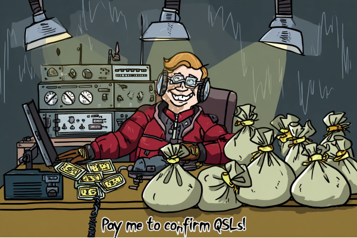

# Introduction
If you are a Amateur Radio Operator in search of uncommon contacts, especially using digital modes, you may have happened upon one of the stations listed below. It is my intention to create a comprehensive list of these stations, so YOU do not waste your time attempting to contact them.
The problem with these stations is that they want to extort money from you, in order for them to simply conform your contact on the [ARRL LOTW Website][https://lotw.arrl.org) which is quite probably the most used online logging site on the internet. 
 

# The List
| Callsign | QRZ | Reason |
|---       |---  |---     |
| CN8NY     | [profile link](https://www.qrz.com/db/CN8NY) | No e-QSL.No LoTW, No QRZ Log,....No e-Log. Just pay $|
| J51A      | [profile link](https://www.qrz.com/db/J51A) | ClubLog OQRS, pay money, then LOTW confirmation |
| TJ1GD     | [profile link](https://www.qrz.com/db/TJ1GD) | Donate to orphanage, then LOTW confirmation |
| TL8GD     | [profile link](https://www.qrz.com/db/TL8GD) | Donate to orphanage, then LOTW conformation |
| TT1GD     | [profile link](https://www.qrz.com/db/TT1GD) | Donate to orphanage, then LOTW confirmation |
| TY5AD     | [profile link](https://www.qrz.com/db/TY5AD) | ClubLog OQRS, then LOTW confirmation |

